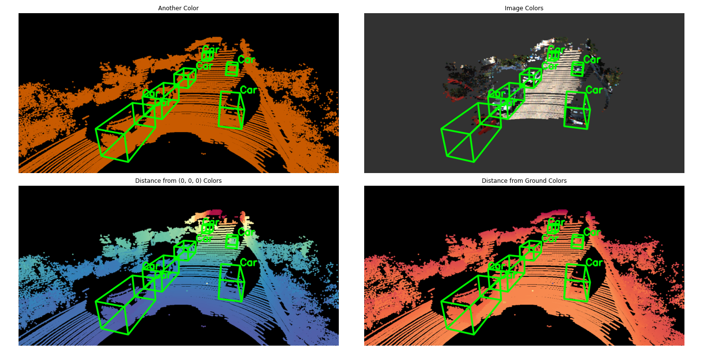
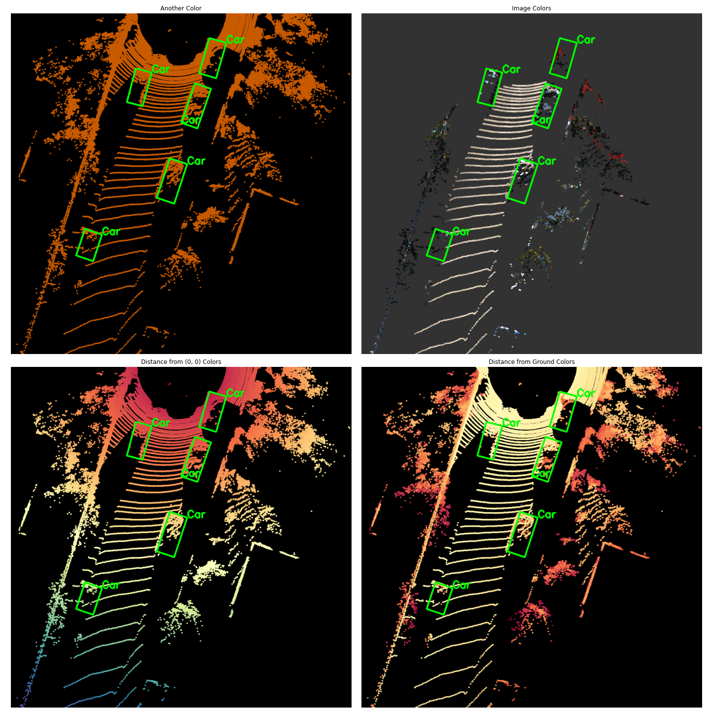

# A Simple Visualizer for 3D point clouds & bounding boxes


Supports 3D & BEV visualizations with a few lines:
```Python
canvas = Canvas_BEV()
canvas_xy, valid_mask = canvas.get_canvas_coords(pts_xyz) # Get Canvas coords
canvas.draw_canvas_points(canvas_xy[valid_mask]) # Only draw valid points
canvas.draw_boxes(gt_lidar_bboxes_3d, texts=gt_names) # Draw boxes
```

## 3D


## BEV

